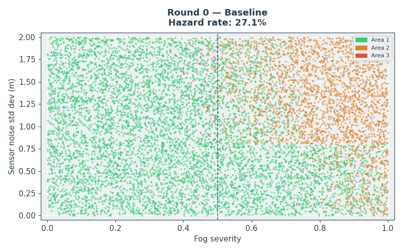
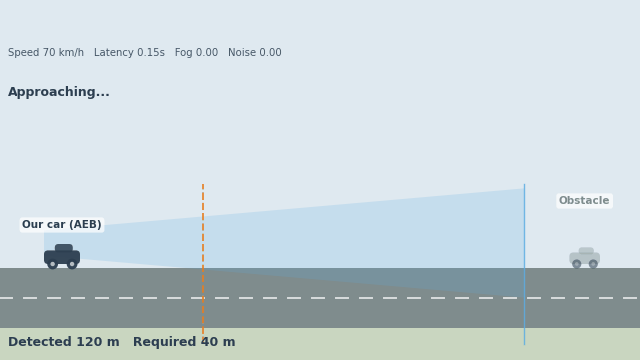
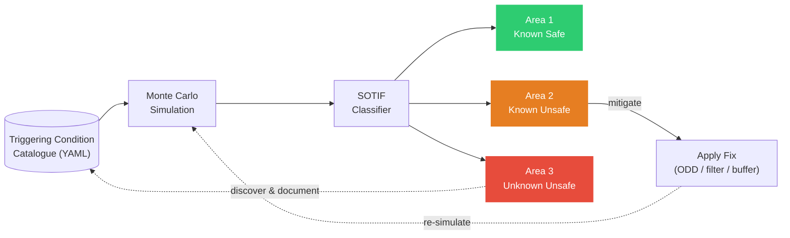

# SOTIF
---

⭐ **1. Introduction**

ISO 26262 addresses hazards arising from system failures. However,
advanced driver assistance systems (ADAS) and automated driving functions
can also become unsafe despite the absence of hardware or software faults.

ISO 21448 (Safety of the Intended Functionality, SOTIF) addresses these
hazards by identifying:

- safe scenarios (Area 1)
- known unsafe scenarios (Area 2)
- unknown unsafe scenarios (Area 3)
- and applying iterative validation and mitigation.

This project implements a simplified SOTIF workflow for an
Automatic Emergency Braking (AEB) function to demonstrate how triggering
conditions can be discovered, documented, classified, and mitigated.

<table>
  <tr>
    <td align="center">
      <b></b> 
      
    </td>
  </tr>
</table>

---

🧩 **2. Challenge**

Automatic Emergency Braking (AEB) operates in complex, dynamic environments where safety depends not only on component reliability but also on environmental conditions (e.g. fog/ glare/ low illumination) and system performance limits (sensor noise/ latency).

Traditional validation approaches are insufficient because many unsafe behaviors arise without any hardware or software failure — instead emerging from **functional limitations under specific operational conditions**, which is the core focus of SOTIF (ISO 21448).

Key challenges include:
- Validating AEB safety across a wide and continuously varying Operational Design Domain (ODD)
- Capturing non-fault-related hazards where correct system behavior still leads to unsafe outcomes
- Identifying non-linear interactions between conditions such as fog, sensor noise, and latency
- Separating known unsafe conditions from previously unknown hazardous scenarios discovered through large-scale simulation
 
---

🎯 **3. Objectives**

Key objectives include:
- Simulate AEB performance across diverse environmental and operational conditions using Monte Carlo scenarios.
- Identify and classify hazardous scenarios using a SOTIF (ISO 21448) area-based framework.
- Distinguish between known unsafe conditions (catalogued triggers) and unknown unsafe scenarios (emergent risks).
- Track how system safety improves across successive design changes such as ODD restrictions, filtering and added safety margins.
---

🛠 **4. Tech Stack**

This project is implemented as a simulation-based safety analysis pipeline combining physics-based modeling, Monte Carlo scenario generation, and SOTIF-driven classification logic.

Key technologies include:
- Python – core orchestration of the AEB safety simulation pipeline
- NumPy – random scenario generation and numerical computation of physical relationships
- Pandas – structured representation of simulated driving scenarios and hazard classification results
- PyYAML – loading and versioning of the triggering-condition catalogue
- SciPy – density estimation for identifying clusters of unsafe scenarios (KDE analysis)
- Matplotlib – visualization of SOTIF area distribution, risk evolution, and scenario space exploration

---
🧠 **5. Key Concepts**

*A. Triggering Condition Catalogue (.yaml)*

The project uses a dedicated triggering-condition catalogue to capture everything the engineering team has learned about unsafe AEB operating conditions. Refer to the `.yaml` file in the repository.

Each catalogue entry records:
- the triggering condition identified (e.g., heavy fog, high sensor noise)
- the operating conditions under which it becomes unsafe
- the mitigation introduced to address it
- the catalogue version in which it was added

This approach is intended to mimic how a safety engineering team would iteratively develop, validate, and refine an ADAS function during a SOTIF (ISO 21448) program. As new hazards are discovered through testing and simulation, they are incorporated into the catalogue, allowing the system to be continuously improved and re-evaluated.

This reflects a key principle of SOTIF: safety knowledge evolves over time!

---

*B. Simulation Methodology (Monte Carlo)*

A Monte Carlo simulation is used to generate a large number of randomized driving scenarios (10,000), allowing the AEB system to be evaluated across a wide range of environmental and operational conditions that would be impractical to test exhaustively in the real world.

Each scenario randomly samples:

| Parameter | Range |
|-----------|-------|
| Ego speed | 30–80 km/h |
| Fog severity | 0.0–1.0 |
| Sensor noise | 0.0–2.0 m |
| Processing latency | 0.0–0.3 s |

For each scenario, the AEB model calculates:
- the distance required for the vehicle to safely stop,
- the effective obstacle detection range of the perception system,
- whether a hazardous situation occurs.

A scenario is classified as hazardous whenever:

> **Detection Range < Required Stopping Distance**

<table>
  <tr>
    <td align="center">
      <b></b> 
      
    </td>
  </tr>
</table>

In the animation above, the blue cone is the sensor's detection range and the dashed orange line marks the distance actually needed to stop — when the orange line falls outside the blue cone, the car can't stop in time.

Watch how fog shortens the blue cone in the second pass, turning a comfortable margin (safe stop) into a shortfall (hazard).

---

*C. SOTIF Classification*

Hazardous scenarios are classified according to the SOTIF (ISO 21448) framework:

| Area | Meaning |
|---|---|
| **Area 1** | Known safe — no hazard |
| **Area 2** | Known unsafe — hazard occurs, and the team has already documented this trigger |
| **Area 3** | Unknown unsafe — hazard occurs, and **no one has documented it yet** |

Unlike conventional threshold-based approaches, Area 2 and Area 3 classifications are determined dynamically using the triggering-condition catalogue (`.yaml`):

- **Match found in the catalogue** → **Area 2 (known unsafe)**
- **No match found in the catalogue** → **Area 3 (unknown unsafe)**

This enables the project to mimic the SOTIF validation process, where previously unknown hazardous scenarios are gradually discovered, documented, and mitigated over successive validation rounds.

---

*D. Iterative Mitigation Process* 

Four validation rounds are performed:

| Round | Mitigation | Purpose |
|-------|------------|---------|
| **0** | Baseline | Establish the initial hazard landscape using the original system configuration and available catalogue knowledge. |
| **1** | Fog ODD restriction | Reduce known hazards by restricting the **Operational Design Domain (ODD)** under severe fog conditions. |
| **2** | Noise filtering | Reduce the impact of sensor noise on perception performance and mitigate the resulting hazardous scenarios. |
| **3** | Additional stopping-distance buffer | Introduce a conservative safety margin to account for residual uncertainty and interaction effects. |

The triggering-condition catalogue evolves throughout the validation process:

- **v1.0 – Fog:** Heavy fog is identified as the first documented unsafe triggering condition through closed-track fog testing.
- **v1.1 – Sensor noise:** High sensor noise is documented following sensor characterization studies, enabling the introduction of a noise-filtering mitigation strategy.
- **v1.2 – Fog–noise interaction:** A previously unknown interaction between fog and sensor noise is discovered through Monte Carlo analysis and incorporated into the catalogue.

This progression demonstrates the central SOTIF principle that system knowledge evolves through iterative validation, discovery, and mitigation.

---
🧠 **6. Simplified System Architecture**

The goal of a SOTIF in this project isn't to make Area 3 disappear by definition — it's to keep finding what's hiding there, document it (i.e. shrinking Area 3, growing Area 2).

Once a risk is known, we build a mitigation for it (e.g. Limiting the ODD/ Building more robust sensor filters). It moves from Area 2 → Area 1 — now it's *actually* safe.

---

📈 **7. Results and Observations**

The simulation was executed over four successive validation rounds. As additional knowledge was gained and mitigations were introduced, the distribution of scenarios across the SOTIF areas evolved accordingly.

| Validation Round | Area 1 (Known Safe) | Area 2 (Known Unsafe) | Area 3 (Unknown Unsafe) | Total Hazard Rate |
|:----------------:|:----------------------:|:------------------------:|:--------------------------:|:-----------------:|
| Round 0 — Baseline | 72.9% | 26.3% | 0.8% | 27.1% |
| Round 1 — ODD Restriction | 91.0% | 7.8% | 1.3% | 9.0% |
| Round 2 — Noise Filtering | 91.9% | 7.2% | 0.9% | 8.1% |
| Round 3 — Safety Buffer | 89.0% | 11.0% | 0.0% | 11.0% |

- **Round 0 — Baseline**

  The baseline configuration resulted in a **27.1% hazardous scenario rate**, consisting primarily of **known hazards (Area 2: 26.3%)** and a small fraction of **unknown hazards (Area 3: 0.8%)**.

  In this illustrative SOTIF case study, the engineering team is assumed to have previously identified that **fog severity > 0.50** can significantly degrade the perception system and has therefore documented this as **TC-001** in the triggering-condition catalogue.

  However, the Monte Carlo simulation also revealed a small cluster of hazardous scenarios occurring when:

  - **fog severity > 0.25**, and
  - **sensor noise > 0.80 m**

  Although neither condition alone was sufficiently severe to be considered unsafe, their combination produced an unexpected degradation in detection performance. Because this interaction had not yet been documented, these scenarios were classified as **Area 3 (unknown unsafe)**.

---

- **Round 1 — Operational Design Domain (ODD) restriction**

  By restricting the **Operational Design Domain (ODD)** to reduce exposure to severe fog conditions, the total hazardous scenario rate decreased from **27.1% to 9.0%**.

  Nevertheless, the rate of **Area 3 scenarios increased slightly from 0.8% to 1.3%**. This occurs because the dominant known hazard (heavy fog) has been reduced, making the previously undiscovered fog–sensor interaction more visible within the remaining scenario population.

---

- **Round 2 — Sensor noise filtering**

  In this illustrative workflow, the engineering team is assumed to have subsequently identified **sensor noise > 1.50 m** as another hazardous operating condition and documented it as **TC-002**.

  Introducing a noise filtering strategy reduced the total hazardous scenario rate further, from **9.0% to 8.1%**, while reducing the unknown hazard rate from **1.3% to 0.9%**.

  However, a small cluster of scenarios with:

  - **fog severity > 0.25**, and
  - **sensor noise between approximately 0.8 m and 1.0 m**

  continued to produce hazardous behavior. Because this interaction had still not been documented in the catalogue, these scenarios remained classified as **Area 3**.

---

- **Round 3 — Discovery of interaction effects**

  Analysis of the residual hazardous scenarios revealed that the combination:

  - **fog severity > 0.25**, and
  - **sensor noise > 0.80 m**

  represented a previously undocumented interaction effect. In this illustrative SOTIF workflow, this interaction was added to the triggering-condition catalogue as **TC-003**.

  After introducing an additional safety margin, all remaining hazardous scenarios became classified as **known hazards (Area 2)**, reducing the **Area 3 rate from 0.9% to 0.0%**.

  Although the final hazardous scenario rate increased slightly to **11.0%**, this reflects a key principle of SOTIF: the objective is not necessarily to eliminate all hazards, but to ensure that hazardous scenarios are identified, understood, documented, and mitigated.
